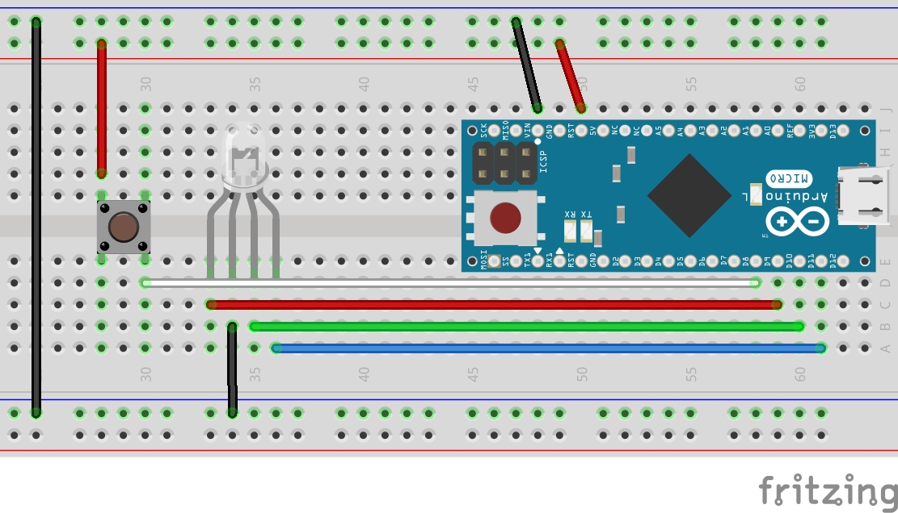

Simple game where you have to repeat the sequence of LED flashes by tapping a button
RGB LED used in this project has common cathode!
## How to run
Assemble everything according to schematics 

Or change the define statements accordingly
```
#define BUT 6
#define RLED 9
#define GLED 10
#define BLED 11
```
## Game settings
You can also change the game settings with define statements below
```
#define minDelays 2         //Minimum amount of delays user has to repeat
#define maxDelays 3         //Maximum amount of delays user has to repeat
#define minDelay 250        //Minimum delay between blinks
#define maxDelay 750        //Maximum delay between blinks
#define tolerance 250       //Tolerance for how off player can be
```
## Demo
